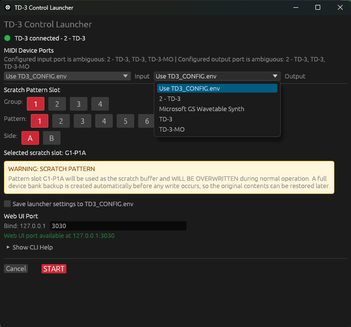

# TD-3 Control

[](https://github.com/roomush/td3-control/actions/workflows/release.yml)
[](https://github.com/rOOmUSh/td3-control/releases)

`td3-control` is a local-first control surface, pattern editor, format toolkit, and pattern library for the Behringer TD-3.

It combines:

- direct TD-3 MIDI control
- a browser-based pattern editor
- multi-pattern composition tools
- progression and bassline generation
- non-saving hardware audition with host-sequenced Note On and Note Off playback
- local Remote Sync for controlling multiple TD-3-family devices from one app instance
- local Bank and snapshot management
- import, export, and conversion between TD-3, DAW, and legacy pattern formats

The app runs locally. There is no cloud account, no remote service, and no browser extension.

## Demo Video

The demonstration video includes subtitles explaining the actions shown.

[](https://www.youtube.com/watch?v=gVzc7TDkym4)

[Watch the demo on YouTube](https://www.youtube.com/watch?v=gVzc7TDkym4)

GitHub README pages do not allow inline YouTube players, so the thumbnail opens the playable video on YouTube.

User-confirmed hardware and firmware reports:

| Device            | Firmware | Reported working workflow                                                |
| ----------------- | -------- | ------------------------------------------------------------------------ |
| Behringer TD-3    | 1.2.6    | Local control UI, USB MIDI connection, transport and Remote Sync control |
| Behringer TD-3    | 1.3.7    | Local control UI, USB MIDI connection, transport and Remote Sync control |
| Behringer TD-3-MO | 2.0.1    | Windows x86_64 release, USB MIDI connection, transport control           |

---

## Quick Start

### 1. Download

Download the latest release zip from the [Releases page](https://github.com/roomush/td3-control/releases).

Choose the package for your platform:

- `td3-control-vX.Y.Z-windows-x86_64.zip`
- `td3-control-vX.Y.Z-macos-aarch64.zip` for Apple Silicon
- `td3-control-vX.Y.Z-macos-x86_64.zip` for Intel Mac
- Linux users can also build from source with `cargo build --release`

Extract the zip anywhere.

### 2. Start

#### Windows

Double-click:

```text
td3-control.exe
```

or:

```text
run.bat
```

#### macOS

Use the Terminal setup steps in [macOS Setup](#macos-setup) after extracting the release zip.

The downloaded release binary must have the quarantine flag removed and a local ad-hoc signature added before the CLI and web UI are started.

#### Linux

Install the native ALSA development package before building:

```sh
sudo apt-get update
sudo apt-get install -y libasound2-dev
```

Build the release binary:

```sh
cargo build --release
```

Run the Linux launcher script:

```sh
chmod +x scripts/dev/run_linux.sh
./scripts/dev/run_linux.sh
```

The script makes `target/release/td3-control` executable, checks MIDI device permissions, and runs the binary from the project directory.

### 3. Choose startup settings



When the launcher opens, choose the startup state before pressing `START`.

The launcher shows `MIDI Device Ports` with separate `Input` and `Output` selectors. Pick the MIDI input and MIDI output for the device this app instance should control. When running more than one device, each app instance should use the input and output ports for only one physical TD-3-family device.

The launcher also shows `Scratch Pattern Slot`. Choose a TD-3 slot such as:

```text
G1P1A
```

This is the scratch slot. It is the TD-3 pattern slot the app is allowed to overwrite during preview, live update, audition, and playback handoff.

Do not choose a slot that contains your only copy of an important pattern.

The launcher shows `Web UI Port`. This is the local browser port for this app instance. The default is usually:

```text
3030
```

Use a different web port for each running app instance, for example `3030`, `3031`, and `3032`.

The checkbox `Save launcher settings to TD3_CONFIG.env` stores the selected scratch slot and web port. It also stores MIDI matching when the selected input and output names are identical. If the MIDI input and output names differ, that MIDI selection is used for the launched session but is not saved as a single `MIDI_PORT_SUBSTRING` value.

### 4. Click START

The app opens the local web UI:

```text
http://127.0.0.1:3030
```

If a TD-3 is connected, the app can control the device.

If no TD-3 is connected, the UI still starts in offline mode. You can still edit, randomize, generate progressions, manage the Bank, and import/export files.

---

## macOS Setup

After downloading and extracting the macOS zip, open Terminal and go into the extracted folder.

For Apple Silicon Macs, use the `aarch64` build:

```bash
cd ~/Downloads/td3-control-v1.1.2-macos-aarch64
```

For Intel Macs, use the `x86_64` build:

```bash
cd ~/Downloads/td3-control-v1.1.2-macos-x86_64
```

### 1. Allow macOS to run the binary

Because this binary is not Apple-notarized, macOS may block it after download. Remove the download quarantine flag:

```bash
xattr -dr com.apple.quarantine .
```

Then add a local ad-hoc signature:

```bash
codesign --force --sign - ./td3-control
```

### 2. Check that the binary works

```bash
./td3-control --help
```

You should see commands such as:

```text
list-ports
control
export
import
```

### 3. Connect your TD-3 by USB

Plug in the TD-3 or TD-3-MO, then check that macOS sees it as a MIDI device:

```bash
./td3-control list-ports
```

Example output:

```text
MIDI Output Ports:
  0: TD-3
  1: TD-3-MO

MIDI Input Ports:
  0: TD-3
  1: TD-3-MO
```

### 4. Start the web UI on port 3030

To control a regular TD-3:

```bash
./td3-control control \
  --port 3030 \
  --bind 127.0.0.1 \
  --midi-in TD-3 \
  --midi-out TD-3 \
  --strict-device-name
```

To control a TD-3-MO instead:

```bash
./td3-control control \
  --port 3030 \
  --bind 127.0.0.1 \
  --midi-in TD-3-MO \
  --midi-out TD-3-MO \
  --strict-device-name
```

The app will ask for confirmation before using the configured scratch pattern slot. Type:

```text
y
```

Then open:

```text
http://127.0.0.1:3030
```

Keep the Terminal window open while using the web UI. Press `Ctrl+C` in Terminal to stop the server.

Important: The configured scratch pattern slot is overwritten during normal operation. The default is `G1-P1A`. The app creates a full device bank backup before writes.

---

## The Basic Workflow

The main workflow is:

1. Connect the TD-3
2. Load or import a pattern
3. Edit one or more patterns
4. Preview through the scratch slot, or use non-save audition when you do not want to write the scratch slot
5. Save to the TD-3, export to files, send to Progressions, or store in the Bank
6. Optionally go to DUCKTRONICS Youtube channel, screenshot a pattern, paste the screenshot to any AI chat, provide AI the .steps.txt format, ask the AI to give you a .steps.txt formatted pattern.
   6.1 Copy the pattern text CTRL+C, paste it into the focused pattern CTRL+V, enable clipboard sharing when the browser pop-up appears.

You can also use the app without hardware for file conversion, pattern editing, Bank work, and progression generation.

---

## Safety Model

TD-3 Control is designed around explicit device writes.

### Scratch slot

The scratch slot is the device slot used for temporary hardware playback workflows:

- live update
- normal preview
- Bank audition
- Progression preview
- transport-driven playback handoff

The slot is shown in the launcher and UI so it is never hidden.

Non-save audition is different. When Live Update is off, or when a pattern row has `NO SAVE` checked, the app can audition a pattern by sending timed MIDI Note On and Note Off messages directly to the TD-3. That path does not write the scratch slot and does not start the TD-3 sequencer.

### Backups

The app creates backups before higher-risk write workflows:

- `control` mode attempts a full-bank backup before the UI can write to the device
- `import-bank` always creates a mandatory pre-write backup before uploading a bank

If the TD-3 is not found during `control` startup, the app enters offline mode and skips the pre-UI backup. If `UI_AUTO_CONNECT_TO_MIDI=0`, startup MIDI probing and the pre-UI backup are skipped until you connect manually from the UI. Other device errors still abort startup instead of silently continuing.

### Device writes

The main write paths are:

| Action                    | What it can write                    |
| ------------------------- | ------------------------------------ |
| Live Update               | configured scratch slot              |
| Normal preview / audition | configured scratch slot              |
| NO SAVE audition          | nothing, MIDI notes only             |
| Save                      | selected TD-3 slot or assigned slots |
| CLI `import`              | one target slot                      |
| CLI `import-bank`         | many slots, with mandatory backup    |

---

## Why It Was Created

I've owned my TD-3 for 5 years now. Except for the classic Wink and New Order 'Confusion' patterns, I've never really enjoyed programming it. The random patterns aren't always fun, either. So, I decided to take matters into my own hands. I created this project to make the process more enjoyable for myself and anyone else who might use it.

- edit patterns directly on the device without losing track of safety
- work on more than one pattern at a time instead of thinking in isolated slots
- generate related musical material quickly
- keep a reusable local library of patterns, snapshots, imports, and backups
- move cleanly between TD-3 data, MIDI files, text formats, and bank formats

---

## Main Features

### Control page

The Control page is the main workspace.

It supports:

- TD-3 MIDI connect and disconnect
- transport start and stop
- Remote Sync start, stop, BPM, and Triplet mirroring from one local app instance to multiple local app instances
- BPM control
- TD-3 sync source switching: `INT`, `USB`, `DIN`, `TRIG`
- note preview
- non-saving pattern audition when Live Update is off or row `NO SAVE` is checked
- pattern load and save
- live update through the scratch slot
- import and export
- keyboard editing
- undo and redo
- focused-pattern editing
- checked-pattern bulk actions

The MIDI status indicator is:

| Status | Meaning                                         |
| ------ | ----------------------------------------------- |
| Grey   | offline or disconnected                         |
| Yellow | connected, but TD-3 sync source is not USB      |
| Green  | connected and ready for USB-controlled playback |

For normal app-driven playback, set the TD-3 sync source to `USB`.

### Multi-pattern editing

The main page can hold up to 64 patterns in one working session.

This enables:

- building variations
- editing multiple patterns together
- duplicating and shifting material
- transposing selected patterns
- arranging playback with timelines
- sending pattern sets into Progressions or the Bank

The editor separates:

- focused pattern: the one being edited directly
- checked patterns: the group used for bulk actions

### Randomization

The app includes two randomization styles.

| Mode               | Best for                                                                  |
| ------------------ | ------------------------------------------------------------------------- |
| Regular randomizer | fast surprise and raw acid-style accidents                                |
| MAGIC randomizer   | more phrase-like patterns with stronger scale, contour, and loop behavior |

Both use the selected root, scale, note density, slide density, and accent density.

### Progressions

Progression mode turns one pattern idea into a four-pattern phrase.

It can:

- generate a connected four-pattern chain
- keep P1 locked and regenerate P2-P4
- use scale profile rules
- generate supporting basslines
- preview basslines in the browser
- preview TD-3 patterns through the device
- export a complete package
- push the result to the TD-3 or into a Bank snapshot

### Bank

The Bank is the local pattern library.

It stores:

- single pattern items
- 64-slot snapshots
- tags
- notes
- favorites
- archive state
- import batches
- duplicate and related-pattern analysis

The Bank uses:

- SQLite for catalog metadata
- sidecar pattern payloads for fast replay, compare, duplicate detection, and snapshot export

It is not just a folder browser. It is a long-term local library for TD-3 material.

### Format toolkit

Supported formats depend on the workflow, but the project works with:

| Format       | Use                                 |
| ------------ | ----------------------------------- |
| `.syx`       | TD-3 SysEx single-pattern payload   |
| `.toml`      | structured editable pattern file    |
| `.json`      | structured interchange format       |
| `.steps.txt` | compact human-readable step format  |
| `.mid`       | DAW import/export                   |
| `.seq`       | SynthTribe-style sequence exchange  |
| `.pat`       | ABL3 pattern text                   |
| `.rbs`       | ReBirth-style song/pattern exchange |
| `.sqs`       | TD-3/SynthTribe full-bank exchange  |

---

## CLI

The same binary also works as a command-line tool.

### List MIDI ports

```sh
td3-control list-ports
```

### Start the web UI directly

```sh
td3-control control --scratch-pattern G1P1A
```

Useful flags:

| Flag                      | Meaning                                       |
| ------------------------- | --------------------------------------------- |
| `--scratch-pattern G1P2A` | scratch slot used by live update and audition |
| `--port 3030`             | HTTP server port                              |
| `--bind 127.0.0.1`        | HTTP bind address                             |
| `--backup-dir ./backups`  | backup directory for pre-UI backup            |

### Export one device pattern

```sh
td3-control export G1P1A --output G1-P1A.steps.txt
```

If `--output` is omitted, export creates a package folder.

### Export a multi-format package

```sh
td3-control export G1-P1A --format syx,toml,steps,json,mid,seq,pat,rbs
```

### Import one pattern to a device slot

```sh
td3-control import G2P3B --input pattern.toml
```

### Convert without a device

```sh
td3-control convert pattern.seq pattern.mid --bpm 132 --loop 4
```

### Extract a full bank

```sh
td3-control extract-bank backup.sqs extracted-bank
```

### Pack a full bank

```sh
td3-control pack-bank extracted-bank new-bank.sqs
```

### Import a full bank to the TD-3

```sh
td3-control import-bank --input new-bank.sqs --backup-dir ./backups
```

`import-bank` is a device-write workflow. It creates a pre-write backup before uploading bank data.

---

## Configuration

The app creates `TD3_CONFIG.env` next to the binary on first run.

Configuration precedence is:

```text
CLI flag -> TD3_CONFIG.env -> bundled default template
```

Important keys include:

| Key                      | Purpose                                        |
| ------------------------ | ---------------------------------------------- |
| `MIDI_PORT_SUBSTRING`    | TD-3 MIDI port matching                        |
| `MIDI_STRICT_NAME_MATCH` | require exact MIDI port match                  |
| `MIDI_TIMEOUT_MS`        | SysEx request timeout                          |
| `MIDI_RETRIES`           | retry count for safe probe/download paths      |
| `WEB_PORT`               | local web server port                          |
| `WEB_BIND`               | local web server bind address                  |
| `UI_SCRATCH_PATTERN`     | scratch slot used by live preview/update flows |
| `BACKUP_DIR_PATH`        | backup zip location                            |
| `LIBRARY_DATABASE_PATH`  | Bank SQLite database path                      |
| `PATTERN_SIDECAR_DIR`    | Bank raw-pattern payload directory             |

Most runtime config changes take effect after restart.

Safety note: binding to `0.0.0.0` makes the local web UI reachable from other machines on the network.

### Multi-device playability

Multiple TD-3 devices can be used at the same time by running separate copies of the app from separate folders. Each folder has its own `TD3_CONFIG.env`, local database paths, and scratch-slot setting.

The startup launcher is the preferred setup path for multiple devices:

1. Start the first app copy.
2. In `MIDI Device Ports`, choose the `Input` and `Output` for the first TD-3-family device.
3. In `Scratch Pattern Slot`, choose the scratch slot for that device.
4. In `Web UI Port`, use `3030` or another free port.
5. Click `START`.
6. Start the next app copy from a separate folder.
7. Choose the MIDI `Input` and `Output` for the next physical device.
8. Choose that device's scratch slot.
9. Set a different `Web UI Port`, such as `3031` or `3032`.
10. Click `START`.

Each running copy owns its selected MIDI input, MIDI output, scratch slot, and local web UI port.

The same setup can also be represented in each folder's `TD3_CONFIG.env`. Use different MIDI port matching and different web ports for each copy. For example:

```text
# Folder A: TD-3-MO
MIDI_PORT_SUBSTRING="TD-3-MO"
WEB_PORT=3030

# Folder B: TD-3
MIDI_PORT_SUBSTRING="TD-3"
WEB_PORT=3031
```

Then open:

```text
http://127.0.0.1:3030
http://127.0.0.1:3031
```

Use distinct scratch slots per device when the devices contain different saved patterns.

Remote Sync can control multiple local app instances from one bottom toolbar. Open every local UI, then use the source instance's `REMOTE` port field to enter the slave web ports. The field accepts comma-separated or whitespace-separated lists such as:

```text
3031,3032
```

or:

```text
3031 3032
```

Turn `REMOTE` on. The source UI probes every configured port before enabling. Duplicate ports are removed, the current UI's own web port is rejected, and a failed probe names the failed port.

For example, from `http://127.0.0.1:3030`, enter `3031,3032` to control app instances on ports `3031` and `3032`. Pressing Play on `3030` sends the same scheduled start target to every configured slave and starts local playback with that same target. Stop, BPM, and main top toolbar Triplet changes are mirrored while `REMOTE` is on. If one slave is unavailable, the status reports that port while the other reachable slaves can still receive commands.

Each remote browser page must be open because that UI owns its own timeline, Live Update state, and no-save audition behavior. If Live Update is off on any side, that instance follows its normal no-save audition path instead of writing the scratch slot. Each instance still uses its own selected patterns, scratch slot, MIDI device, and pattern rules. Per-pattern row Triplet buttons remain local to their own app instance. See [Bottom Toolbar](docs/BOTTOM_TOOLBAR.md#remote-sync) for screenshots and setup details.

Known limitations:

- Remote Sync does not promise continued sync when devices play patterns with different active step counts. In that case devices can drift or land off sync.
- If devices go off sync, stop playback and press Play again to realign them.
- When both devices play patterns with the same active step count, local two-device testing stayed in sync during mirrored Play, Stop, and BPM operation.

---

## Building From Source

Use this path if you want to develop, test, or build your own binary.

```sh
git clone https://github.com/roomush/td3-control.git
cd td3-control
cargo run -- control --scratch-pattern G1P1A
```

During development, the UI is read from `ui/` on disk. HTML, CSS, and JavaScript changes are picked up on browser refresh.

Release builds embed the UI into the binary so the distributed executable does not need an `ui/` directory next to it.

### Prerequisites

- Rust toolchain
- Behringer TD-3 for live hardware workflows
- Node.js only if you want to run frontend module tests with the `js_tests_*` scripts

Linux also requires ALSA development headers for the `midir` dependency:

```sh
sudo apt-get update
sudo apt-get install -y libasound2-dev
```

On Debian, Ubuntu, and Linux Mint this package provides the `alsa.pc` file used by `pkg-config`. If it is missing, `cargo build` can fail with:

```text
error: could not find system library 'alsa' required by the 'alsa-sys' crate
Package 'alsa', required by 'virtual:world', not found
```

### Run tests

Rust tests:

Linux:

```sh
chmod +x scripts/dev/rust_tests_linux.sh
./scripts/dev/rust_tests_linux.sh
```

macOS:

```sh
chmod +x scripts/dev/rust_tests_macos.sh
./scripts/dev/rust_tests_macos.sh
```

Windows:

```powershell
.\scripts\dev\rust_tests_win.bat
```

Rust integration tests:

Linux:

```sh
chmod +x scripts/dev/rust_integration_test_linux.sh
./scripts/dev/rust_integration_test_linux.sh
```

macOS:

```sh
chmod +x scripts/dev/rust_integration_test_macos.sh
./scripts/dev/rust_integration_test_macos.sh
```

Windows:

```powershell
.\scripts\dev\rust_integration_test_win.bat
```

Frontend module tests:

Linux:

```sh
chmod +x scripts/dev/js_tests_linux.sh
./scripts/dev/js_tests_linux.sh
```

macOS:

```sh
chmod +x scripts/dev/js_tests_macos.sh
./scripts/dev/js_tests_macos.sh
```

Windows:

```powershell
.\scripts\dev\js_tests_win.bat
```

Run helpers:

Linux:

```sh
chmod +x scripts/dev/run_linux.sh
./scripts/dev/run_linux.sh
```

macOS:

```sh
chmod +x scripts/dev/run_macos.sh
./scripts/dev/run_macos.sh
```

Windows:

```powershell
.\scripts\dev\run_windows.bat
```

---

## Platform Notes

### Windows

Windows is the primary development host.

The project includes:

- Windows launcher and helper scripts
- 1 ms multimedia timer resolution
- `THREAD_PRIORITY_TIME_CRITICAL` support
- high-resolution waitable timer for the MIDI clock thread
- native folder picker for Bank folder scan

### macOS

macOS is supported.

The project includes:

- Apple Silicon and Intel release packages
- Mach `THREAD_TIME_CONSTRAINT_POLICY` for the MIDI clock thread
- AppleScript folder picker for Bank folder scan

Downloaded release binaries require the Terminal setup steps in [macOS Setup](#macos-setup) before first launch.

### Linux and other Unix

Linux and other Unix builds compile and run, but support is less polished.

For USB MIDI, the TD-3 should appear as a standard ALSA USB MIDI device. You can check detection with:

```sh
lsusb
aconnect -l
```

If `aconnect -l` or `td3-control list-ports` fails with:

```text
open /dev/snd/seq failed: Permission denied
```

add your user to the `audio` group, then log out and back in:

```sh
sudo usermod -aG audio "$USER"
```

After running the command, this can be applied to the current terminal with:

```sh
newgrp audio
```

The source tree includes `scripts/dev/run_linux.sh` for local release builds:

```sh
chmod +x scripts/dev/run_linux.sh
./scripts/dev/run_linux.sh
```

It runs `target/release/td3-control`, forwards any command-line arguments, and prints the MIDI permission fix if `/dev/snd/seq` is not readable.

Known limitations:

- Bank Browse button is not wired to a native folder picker
- MIDI clock thread runs at default scheduling priority

The sleep plus spin-tail fallback is still used for timing.

---

## Documentation

Detailed docs live in `docs/`.

Start here:

- [MAIN](docs/MAIN.md) - Control page and core workflow
- [FAQ](docs/FAQ.md) - common user questions
- [CLI](docs/CLI.md) - command-line usage
- [FORMATS](docs/FORMATS.md) - supported file formats
- [SETTINGS](docs/SETTINGS.md) - runtime config and UI settings

Deeper internals:

- [MULTIPATTERN TECHNOLOGY](docs/MULTIPATTERN_TECHNOLOGY.md)
- [PROGRESSIONS](docs/PROGRESSIONS.md)
- [BANK](docs/BANK.md)
- [BANK BUTTONS](docs/BANK_BUTTONS.md)
- [TECHNICAL ARCHITECTURE](docs/TECHNICAL_ARCHITECTURE.md)

UI reference:

- [MAIN PAGE TOOLBAR](docs/MAIN_PAGE_TOOLBAR.md)
- [MAIN SECONDARY TOOLBAR](docs/MAIN_SECONDARY_TOOLBAR.md)
- [SIDEBAR](docs/SIDEBAR.md)
- [BOTTOM TOOLBAR](docs/BOTTOM_TOOLBAR.md)
- [PATTERN ROW BUTTONS](docs/PATTERN_ROW_BUTTONS.md)
- [SIMPLE VS. MAGIC RANDOMIZER](docs/SIMPLE_VS_MAGIC_RANDOMIZER.md)

---

## FAQ

### Do I need a TD-3 connected?

No.

You need the TD-3 for:

- live device control
- direct device import/export
- transport playback
- preview and audition through hardware
- changing the device sync source from the UI

You do not need it for:

- editing patterns
- randomization
- progression generation
- bassline export
- file conversion
- Bank browsing and organization
- snapshot management

### Will it overwrite my TD-3 patterns?

It can overwrite the configured scratch slot during normal preview and live workflows.

Non-save audition does not write TD-3 pattern memory. It sends timed MIDI notes directly to the connected device.

The app warns about this and uses backups for larger write operations.

Use a scratch slot that you are comfortable overwriting.

### Why does PLAY do nothing?

The TD-3 must be connected and set to USB sync if the app is going to drive playback.

Use the `INT / USB / DIN / TRIG` sync controls in the bottom toolbar and choose `USB`.

### Why is there both a web UI and a CLI?

They solve different problems.

The web UI is better for:

- editing
- live playback
- randomization
- progression work
- Bank browsing

The CLI is better for:

- conversion
- scripted workflows
- quick MIDI port inspection
- bank extract and pack
- direct import/export from terminal

Both use the same Rust core.

---

## Release Status

`v1.0.0` means the core workflow is usable and tested on the author's setup.

It does not mean every TD-3 firmware version, MIDI interface, DAW path, or operating system environment has been exhaustively validated.

Expected stable areas:

- core pattern model
- TD-3 slot addressing
- supported single-pattern formats
- Bank snapshot shape
- CLI command structure
- local-first workflow

Areas that may still evolve:

- UI layout
- undocumented internal APIs
- progression rules
- Magic randomizer behavior
- Bank analysis heuristics
- external integration expectations

---

## CREDITS

Many thanks to AudioPump and 303patterns.com for publishing the documentation of the TD-3 SysEx protocol that was used in this project.  https://303patterns.com/td3-midi.html Documented by Brad Isbell brad@audiopump.co, AudioPump, Inc. https://audiopump.co/ 

---

## License

See [LICENSE](LICENSE).
