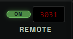
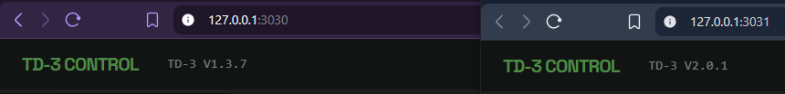
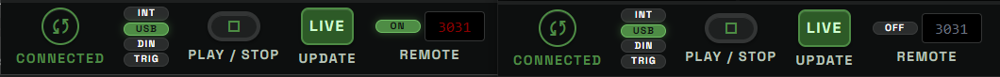

# Bottom Toolbar

## What The Bottom Toolbar Is For

The bottom toolbar is the performance and device-control strip on the Control page.

It handles the parts of the workflow that affect playback, MIDI connection, timing, and live communication with the TD-3. Pattern writing, pattern editing, import, export, randomization, and bank work happen elsewhere in the interface. The bottom toolbar is mainly about answering four practical questions:

- Is the TD-3 connected?
- What clock source is the TD-3 using?
- Is the pattern playing?
- What tempo is being used?

## MIDI Connection Button

The round button on the left connects or disconnects the TD-3 MIDI session.

When the app is disconnected, the button shows a warning-style icon and the label reads `DISCONNECTED`.

Clicking it asks the app to connect to the TD-3. When connection succeeds, the app can send patterns, control transport, update tempo, and use preview workflows that depend on the hardware.

Clicking it again disconnects the MIDI session.

The color also matters:

- Grey or red means the app is not connected to the TD-3.
- Green means the TD-3 is connected and ready for USB-controlled playback.
- Yellow means the TD-3 is connected, but its sync source is not USB, so the app may not be able to drive playback from the toolbar.

If the toolbar says the TD-3 is disconnected, editing and file work can still be useful, but hardware playback and direct device writes are unavailable.

## Sync Source Buttons

The small vertical column marked `INT`, `USB`, `DIN`, and `TRIG` controls the TD-3 clock source.

These buttons tell the TD-3 where its timing should come from:

- `INT` uses the TD-3 internal clock.
- `USB` lets the app drive playback timing over USB.
- `DIN` uses external MIDI DIN sync.
- `TRIG` uses trigger sync.

For normal use with this app, choose `USB`. That is the mode where the Play button and BPM control are intended to drive the TD-3 from the web interface.

Use the other sync sources when the TD-3 should follow another piece of gear instead of the app. For example, `DIN` can be useful when another sequencer or drum machine is the master clock.

The sync buttons are disabled while no TD-3 is connected. The active source is highlighted when the app can read it from the device.

## Play And Stop

The large round `PLAY / STOP` button starts and stops TD-3 playback.

When stopped, the button shows a play icon. Click it to start playback at the current BPM.

When playing, the button changes to a stop icon. Click it again to stop the TD-3.

On a single focused pattern, playback loops that pattern.

When the timeline contains multiple pattern slots, playback follows the timeline order. The app prepares the next pattern before the TD-3 reaches the loop point so the hardware can move into the next pattern cleanly.

When Live Update is off, the play button uses host-sequenced audition for the focused pattern. In that mode the app sends timed MIDI Note On and Note Off messages directly to the TD-3, without writing the scratch slot or starting the TD-3 sequencer.

Playback requires a MIDI connection. If the TD-3 is disconnected, the status message will ask you to connect MIDI first.

## Live Update

The `LIVE` button controls whether pattern changes are sent automatically to the configured scratch slot while you work.

When Live Update is on, edits can be pushed to the TD-3 scratch slot shortly after you make them. This is useful when you want to hear changes on the hardware without manually saving after every edit.

When Live Update is off, edits stay in the app until you explicitly send, save, preview, or push them through another control. Bottom-toolbar play and row preview use non-saving host audition in this state, so the focused pattern can still be heard on the TD-3 without writing the scratch slot.

Live Update is powerful because it makes the TD-3 feel connected to the editor in real time. It should also be used with awareness: the scratch slot is meant to be overwritten during live work.

## Remote Sync

The `REMOTE` control lets one local td3-control server start another local td3-control server from the bottom toolbar.

Use this when two app instances are open on the same computer, with one instance connected to one device and the other instance connected to a second device. For example:

- TD-3 Control running on port `3030`
- TD-3-MO Control running on port `3031`

The browser address bars show which port each app instance is using:

To control the second device from the first toolbar:

1. Open both app instances in the browser.
2. Connect each app instance to its own MIDI device.
3. In the `3030` toolbar, enter `3031` in the remote port field.
4. Turn `REMOTE` on.
5. Press `PLAY / STOP` in the `3030` toolbar.

When `REMOTE` is on, pressing Play on the source toolbar sends a play command to the other local server before local playback starts. The source app starts local playback only after the remote server accepts the command. Because both servers communicate over `127.0.0.1`, the two app instances usually begin immediately and very close together.

Stop, BPM, and main top toolbar Triplet changes are also mirrored while `REMOTE` is on. Remote-triggered commands do not send commands back to the source, so the two app instances do not loop commands into each other.

Important details:

- The remote port field should contain only the other local web port, such as `3031`.
- Turning `REMOTE` on probes the configured port first. If no local server is listening, the button stays off and the status shows `No server on port 3031`.
- The remote app page must be open in the browser, because its UI owns its own timeline, Live Update, and no-save audition state.
- Each app instance still uses its own selected patterns, timeline, Live Update mode, scratch slot, BPM display, and connected MIDI device.
- Only the main top toolbar Triplet button is mirrored. Per-pattern row Triplet buttons remain local.
- If the remote app is not open or not listening, the source app reports the remote sync error and does not start local playback.
- This is practical synchronized start for two local devices. A dedicated shared MIDI clock is still the stricter option when absolute hardware timing is required.

Known limitations:

- Remote Sync does not promise continued sync when the two devices play patterns with different active step counts. In that case the devices can drift or land off sync.
- If the two devices go off sync, stop playback and press Play again to realign them.
- When both devices play patterns with the same active step count, local two-device testing stayed in sync during mirrored Play, Stop, and BPM operation.

## BPM Display

The large number in the bottom toolbar is the current BPM.

This tempo is used for app-driven playback and preview timing. When the TD-3 is connected and playing from USB sync, BPM changes are sent to the device.

The displayed value updates as you change the tempo. In normal mode it is shown as a whole BPM value. When fine mode is enabled, it shows centi-BPM precision with two decimal places.

## BPM Fine Mode

The `.00` toggle next to the BPM control switches between whole-BPM editing and centi-BPM editing.

When `.00` is off:

- the display uses whole BPM values
- the mouse wheel changes tempo by `1` BPM
- leaving fine mode truncates any fractional BPM value to the whole number

When `.00` is on:

- the display shows values such as `120.50`
- the mouse wheel changes tempo by `0.01` BPM
- playback, preview, and host audition use the fractional tempo

## BPM Knob

The round BPM knob changes the tempo.

You can adjust it in two ways:

- Scroll the mouse wheel over the knob to move the tempo up or down. The step size is `1` BPM in normal mode and `0.01` BPM in fine mode.
- Click and drag the knob vertically for faster changes.

If playback is already running, the app updates the playback timer and sends the new BPM to the TD-3 when possible.

## Status Message

The text area on the right side of the bottom toolbar shows short status messages.

It reports what just happened, such as:

- connected or disconnected MIDI
- playback started or stopped
- BPM update errors
- live-send results
- timeline playback position
- device communication errors

This message area is not a full log. It is a quick feedback line so you can tell whether the last action succeeded, failed, or needs attention.

## Recommended Use

For the most common workflow:

1. Connect the TD-3 with the MIDI button.
2. Set the sync source to `USB`.
3. Choose a BPM with the knob.
4. Enable `.00` when you need centi-BPM tempo changes.
5. Turn `LIVE` on if you want edits to reach the scratch slot automatically.
6. Leave `LIVE` off when you want non-saving host audition.
7. Turn `REMOTE` on and enter the other local port when you want a second local device to start with this toolbar.
8. Press `PLAY / STOP` to start and stop playback.
9. Watch the status message when something does not behave as expected.

The bottom toolbar is designed to keep the hardware side visible while the rest of the page focuses on pattern creation.
