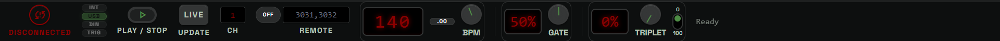
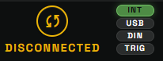
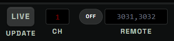
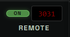
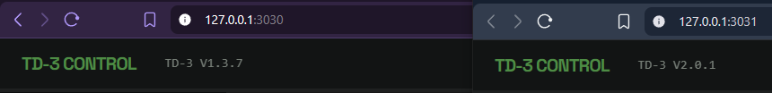
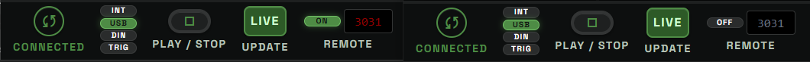
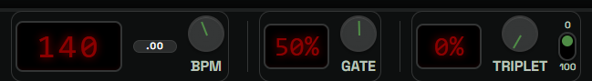

# Bottom Toolbar

## What The Bottom Toolbar Is For

The bottom toolbar is the performance and device-control strip on the Control page.

It handles the parts of the workflow that affect playback, MIDI connection, timing, and live communication with the TD-3. Pattern writing, pattern editing, import, export, randomization, and bank work happen elsewhere in the interface. The bottom toolbar is mainly about answering these practical questions:

- Is the TD-3 connected?
- What clock source is the TD-3 using?
- Is the pattern playing?
- What tempo is being used?
- Which MIDI channel does the TD-3 listen on?
- How long should host-audition notes be held?
- How straight or triplet should host audition feel?

The `CH`, `GATE`, and `TRIPLET` controls belong to host audition and appear only while `LIVE` is off.

## MIDI Connection Button

The round button on the left connects or disconnects the TD-3 MIDI session.

When the app is disconnected, the button shows a warning-style icon and the label reads `DISCONNECTED`.

Clicking it asks the app to connect to the TD-3. When connection succeeds, the app can send patterns, control transport, update tempo, and use preview workflows that depend on the hardware.

Clicking it again disconnects the MIDI session.

The color also matters:

- Grey or red means the app is not connected to the TD-3.
- Green means the TD-3 is connected and ready for USB-controlled playback.
- Yellow means the TD-3 is connected, but its sync source is not USB, so the app may not be able to drive playback from the toolbar.

If the toolbar says the TD-3 is disconnected, editing and file work can still be useful, but hardware playback and direct device writes are unavailable.

## Sync Source Buttons

The small vertical column marked `INT`, `USB`, `DIN`, and `TRIG` controls the TD-3 clock source.

These buttons tell the TD-3 where its timing should come from:

- `INT` uses the TD-3 internal clock.
- `USB` lets the app drive playback timing over USB.
- `DIN` uses external MIDI DIN sync.
- `TRIG` uses trigger sync.

For normal use with this app, choose `USB`. That is the mode where the Play button and BPM control are intended to drive the TD-3 from the web interface.

Use the other sync sources when the TD-3 should follow another piece of gear instead of the app. For example, `DIN` can be useful when another sequencer or drum machine is the master clock.

The sync buttons are disabled while no TD-3 is connected. The active source is highlighted when the app can read it from the device.

## Play And Stop

The large round `PLAY / STOP` button starts and stops TD-3 playback.

When stopped, the button shows a play icon. Click it to start playback at the current BPM.

When playing, the button changes to a stop icon. Click it again to stop the TD-3.

On a single focused pattern, playback loops that pattern.

When the timeline contains multiple pattern slots, playback follows the timeline order. The app prepares the next pattern before the TD-3 reaches the loop point so the hardware can move into the next pattern cleanly.

When Live Update is off, the play button uses host-sequenced audition for the focused pattern. In that mode the app sends timed MIDI Note On and Note Off messages directly to the TD-3, without writing the scratch slot or starting the TD-3 sequencer.

Playback requires a MIDI connection. If the TD-3 is disconnected, the status message will ask you to connect MIDI first.

## Live Update

The `LIVE` button controls whether pattern changes are sent automatically to the configured scratch slot while you work.

When Live Update is on, edits can be pushed to the TD-3 scratch slot shortly after you make them. This is useful when you want to hear changes on the hardware without manually saving after every edit.

When Live Update is off, edits stay in the app until you explicitly send, save, preview, or push them through another control. Bottom-toolbar play and row preview use non-saving host audition in this state, so the focused pattern can still be heard on the TD-3 without writing the scratch slot.

Live Update is powerful because it makes the TD-3 feel connected to the editor in real time. It should also be used with awareness: the scratch slot is meant to be overwritten during live work.

## CH: Device MIDI Channel

The `CH` selector sets which MIDI channel the app addresses the TD-3 on. It must match the channel the device itself is set to.

Two things the app does are channel-addressed, and both are silent when the channel is wrong:

- non-saving host audition, where the app sends timed Note On and Note Off from the host
- the keyboard note preview

Device playback is not channel-addressed. `LIVE` playback writes the pattern over SysEx and drives the TD-3 sequencer with MIDI realtime Start, Clock, and Stop, none of which carry a channel. A device left on a mismatched channel therefore plays normally in `LIVE` mode and produces nothing in NO-LIVE. That combination is the usual sign that this setting needs changing, not that playback is broken.

The channel is a device setting, not an app setting. It is changed on the TD-3 itself, for example in Behringer's SynthTribe application. The app cannot read it back reliably, so it has to be told which channel to use.

How the value is chosen:

- `MIDI_DEVICE_CHANNEL` in `TD3_CONFIG.env` supplies the value the selector starts on. The default is `1`.
- The selector overrides it for the current browser session, with no restart and no file editing.
- The channel travels with each audition and preview request, so a change takes effect on the next request. Playback already running is not restarted.
- The choice is shared by the Control and Progression pages.

Like `GATE` and `TRIPLET`, the selector is visible only while `LIVE` is off, because it belongs to host audition. Turning `LIVE` on hides it without discarding the value.

Set `MIDI_DEVICE_CHANNEL` for the channel a device normally uses, and use the selector when moving between devices on different channels.

## Remote Sync

The `REMOTE` control lets one local td3-control server control one or more other local td3-control servers from the bottom toolbar.

Use this when multiple app instances are open on the same computer, with each instance connected to its own device. For example:

- TD-3 Control running on port `3030`
- TD-3-MO Control running on port `3031`
- another TD-3 Control instance running on port `3032`

The browser address bars show which port each app instance is using:

To control other devices from the first toolbar:

1. Open every app instance in the browser.
2. Connect each app instance to its own MIDI device.
3. In the `3030` toolbar, enter the remote web ports in the remote port field.
4. Use comma-separated or whitespace-separated ports, such as `3031,3032` or `3031 3032`.
5. Turn `REMOTE` on.
6. Press `PLAY / STOP` in the `3030` toolbar.

When `REMOTE` is on, pressing Play on the source toolbar sends the same scheduled play target to every configured local server and starts local playback with that same target. Because all servers communicate over `127.0.0.1`, the app instances usually begin immediately and very close together.

Stop, BPM, and main top toolbar Triplet changes are also mirrored while `REMOTE` is on. Remote-triggered commands do not send commands back to the source, so app instances do not loop commands into each other.

Important details:

- The remote port field accepts local web ports such as `3031`, `3031,3032`, or `3031 3032`.
- Up to 8 remote ports can be configured.
- Duplicate ports are removed in first-seen order.
- The current browser's own web port is rejected so an instance does not relay to itself.
- Turning `REMOTE` on probes every configured port first. If a local server is not listening, the button stays off and the status names the failed port.
- Each remote app page must be open in the browser, because its UI owns its own timeline, Live Update, and no-save audition state.
- Each app instance still uses its own selected patterns, timeline, Live Update mode, scratch slot, BPM display, and connected MIDI device.
- Only the main top toolbar Triplet button is mirrored. Per-pattern row Triplet buttons remain local.
- If a remote app is not open or not listening, the source app reports the remote sync error with the failed port.
- This is practical synchronized start for local devices. A dedicated shared MIDI clock is still the stricter option when absolute hardware timing is required.

Known limitations:

- Remote Sync does not promise continued sync when devices play patterns with different active step counts. In that case devices can drift or land off sync.
- If devices go off sync, stop playback and press Play again to realign them.
- When devices play patterns with the same active step count, local testing stayed in sync during mirrored Play, Stop, and BPM operation.

## BPM Display

The large number in the bottom toolbar is the current BPM.

This tempo is used for app-driven playback and preview timing. When the TD-3 is connected and playing from USB sync, BPM changes are sent to the device.

The displayed value updates as you change the tempo. In normal mode it is shown as a whole BPM value. When fine mode is enabled, it shows centi-BPM precision with two decimal places.

## BPM Fine Mode

The `.00` toggle next to the BPM control switches between whole-BPM editing and centi-BPM editing.

When `.00` is off:

- the display uses whole BPM values
- the mouse wheel changes tempo by `1` BPM
- leaving fine mode truncates any fractional BPM value to the whole number

When `.00` is on:

- the display shows values such as `120.50`
- the mouse wheel changes tempo by `0.01` BPM
- playback, preview, and host audition use the fractional tempo

## BPM Knob

The round BPM knob changes the tempo.

You can adjust it in two ways:

- Scroll the mouse wheel over the knob to move the tempo up or down. The step size is `1` BPM in normal mode and `0.01` BPM in fine mode.
- Click and drag the knob vertically for faster changes.

If playback is already running, the app updates the playback timer and sends the new BPM to the TD-3 when possible.

## Gate

The `GATE` control sets how long ordinary notes are held during non-saving host audition. Its value is an integer from `1%` to `100%` of one pattern step:

- `1%` produces the shortest supported note.
- `50%` is the default and matches the previous host-audition gate.
- `100%` holds the note for one full step.

Higher values produce longer notes. Gate also controls the final sounding tail of a tied-note group. Rests, accents, terminal slides, connected TD-3 slide overlap, and the overall pattern cycle length keep their existing behavior.

The control is visible only while `LIVE` is off. Its value is shared by the Control and Progression pages for the current browser session. Turning `LIVE` on hides the control without discarding the value, and an explicit row `NO SAVE` preview continues to use that retained value while the control is hidden.

You can adjust gate in these ways:

- Scroll the mouse wheel over the knob to change it by `1%`.
- Drag vertically. Every 3 pixels changes the value by `1%`.
- Focus the knob and use an arrow key to change it by `1%`.
- Press `Home` for `1%` or `End` for `100%`.

Changing gate during host audition does not restart playback or change its cadence. The currently sounding note reaches its already scheduled Note Off, then later notes use the new value. Step highlighting continues from the current playback position.

Gate does not affect device-sequenced `LIVE` playback, keyboard note preview, Remote Sync messages, pattern files, or exported MIDI.

## TRIPLET Morph Control

The `TRIPLET` control warps non-saving host audition from a straight
feel toward a triplet feel. Its value is a whole percentage from `0%`
to `100%`:

- `0%` plays the ordinary straight pattern.
- Intermediate values slide the offbeats toward triplet positions.
- `100%` plays three evenly spaced notes per beat instead of four.

Tempo, bar length, and beat starts do not change at any amount, and
nothing is written to the TD-3. Returning the knob to `0%` reveals the
unchanged original pattern.

Like `GATE`, the control is visible only while `LIVE` is off, because
it belongs to non-saving host audition. Turning `LIVE` on stops the
audition, restores the straight view, and resets the amount to `0%`.

The small switch beside the knob jumps straight to the opposite
endpoint: up is `0`, down is `100`.

You can adjust the amount in these ways:

- scroll the mouse wheel over the knob to change by `1`
- drag the knob vertically
- focus the knob and use the arrow keys to change by `1`
- press `PageUp` or `PageDown` to change by `10`
- press `Home` for `0` or `End` for `100`
- click the switch to snap to the other endpoint

Full behavior, including which note is removed at the endpoint and what
can be edited while morphed, is documented in
[Triplet Morph](TRIPLET_MORPH.md).

## Status Message

The text area on the right side of the bottom toolbar shows short status messages.

It reports what just happened, such as:

- connected or disconnected MIDI
- playback started or stopped
- BPM update errors
- live-send results
- timeline playback position
- device communication errors

This message area is not a full log. It is a quick feedback line so you can tell whether the last action succeeded, failed, or needs attention.

## Recommended Use

For the most common workflow:

1. Connect the TD-3 with the MIDI button.
2. Set the sync source to `USB`.
3. Choose a BPM with the knob.
4. Enable `.00` when you need centi-BPM tempo changes.
5. Leave `LIVE` off and set `CH` to the channel the TD-3 is on when you want non-saving host audition.
6. Choose a `GATE` value, and a `TRIPLET` amount if you want a triplet feel.
7. Turn `LIVE` on if you want edits to reach the scratch slot automatically.
8. Turn `REMOTE` on and enter the other local ports when you want additional local devices to follow this toolbar.
9. Press `PLAY / STOP` to start and stop playback.
10. Watch the status message when something does not behave as expected.

If host audition is silent while `LIVE` playback works, check `CH` first.

The bottom toolbar is designed to keep the hardware side visible while the rest of the page focuses on pattern creation.
