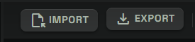
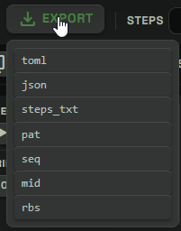
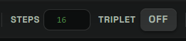
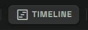
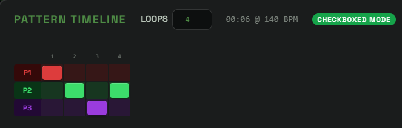
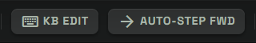
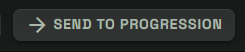
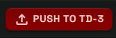
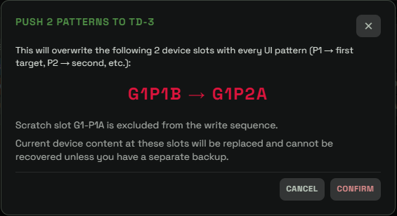

# Main Page Toolbar

## What The Main Page Toolbar Is For

The main page toolbar is the control strip above the pattern cards.

It is separate from the left sidebar and the bottom transport bar:

- The sidebar chooses TD-3 slots and generation settings.
- The bottom toolbar handles MIDI connection, playback, Live Update, and BPM.
- The main page toolbar manages files, pattern list structure, batch edits, slot views, bank handoff, progression handoff, and full device push workflows.

On the Control page, the toolbar is split into two rows. The top row covers file, timing, keyboard, progression, device push, and reset actions. The second row covers pattern-list management and batch transformations.

## Import

`IMPORT` brings pattern files into the main editor.

For single-pattern files, the imported pattern is added as a new pattern card at the end of the current list. Focus moves to the imported card.

Supported single-pattern import formats include:

- `.toml`
- `.json`
- `.steps.txt`
- `.txt`
- `.pat`
- `.seq`
- `.mid`
- `.midi`

Bank-style files such as `.sqs` and `.rbs` can contain many patterns. When importing those, the app opens a picker so you can choose which slots to bring into the editor.

Import does not require the TD-3 to be connected. It is a file workflow.

## Export

`EXPORT` opens a format menu.

Choose a format from the dropdown to download the focused pattern. The filename uses the current sidebar slot address so the exported file is easier to identify later.

Available export choices are:

- `toml`: editable and re-importable project text.
- `json`: structured re-importable pattern data.
- `steps_txt`: human-readable step text.
- `pat`: ABL3 pattern format.
- `seq`: Behringer SynthTribe pattern format.
- `mid`: standard MIDI file for DAW use.
- `rbs`: ReBirth-style pattern export.

Export does not write to the TD-3. It downloads a file from the current UI pattern.

## Steps

`STEPS` controls the active step count.

The value is clamped from `1` to `16`.

On the main multipattern page, this is a global control. Changing it applies the same active-step count to every pattern card in the current list.

Use it when you want all patterns to share the same loop length. If only one card should change, use that card's own step controls instead.

## Triplet

`TRIPLET` controls triplet timing for the current toolbar target set.

Its targeting matches the other batch toolbar controls:

- If one or more cards are checked, it affects the checked cards.
- If no cards are checked, it affects all pattern cards.

The button shows `ON` only when every current target already has triplet timing on.

If the target set is mixed, or if every target is off, the button shows `OFF`. Clicking it then turns triplet timing on for the whole target set. If every target is already on, clicking it turns triplet timing off for the whole target set.

Triplet timing changes how the pattern is interpreted during playback and export. It does not change the note names, rests, slides, or accents by itself.

Use the per-card triplet control when only one pattern should change.

## Timeline

`TIMELINE` opens the multipattern timeline editor.

The timeline decides which pattern card plays at each timeline position. It is useful when you are arranging several patterns into a longer sequence.

The timeline supports two practical modes:

- With no checked cards, it uses the normal timeline.
- With checked cards, it uses a checked-pattern timeline so selected patterns can have their own playback arrangement.

Use `TIMELINE` when you want to hear multiple patterns as a sequence instead of looping only the focused card.

## KB Edit

`KB EDIT` turns keyboard step editing on or off.

When it is on, configured keyboard keys can edit the selected step. Depending on your keyboard mapping, keys can enter notes, toggle accents, toggle slides, set rest, change transpose, move between steps, randomize, or start playback.

When it is off, normal page typing and shortcuts are less likely to affect pattern steps.

Use `KB EDIT` when you want faster step entry from the computer keyboard.

## Auto-Step Fwd

`AUTO-STEP FWD` controls whether keyboard editing automatically moves to the next step after an edit.

When it is on, entering a note or changing a step can advance the selected step forward. This makes fast pattern entry feel closer to step recording.

When it is off, edits stay on the current selected step until you move manually.

If auto-step wraps from step 16 back to step 1, focus can advance to the next pattern in the active editing set.

## Send To Progression

`SEND TO PROGRESSION` sends the focused pattern to the Progression page as `P1`.

The app also sends the current root and scale from the sidebar. Progression mode then uses that material as the start of a four-pattern progression workflow.

Use this when you have a single pattern you like and want the app to build related musical patterns around it.

## Push To TD-3

`PUSH TO TD-3` writes every pattern in the current UI list to the TD-3.

This is different from sidebar `SAVE`:

- Sidebar `SAVE` is selection-aware and can write one focused pattern or checked patterns.
- `PUSH TO TD-3` is a full-list operation. It writes the whole current pattern set.

The target slots are assigned using the current sidebar slot as the starting point and the current A/B mode from the toolbar. The configured scratch slot is excluded so the push does not overwrite the slot reserved for preview and live update.

If the list contains 64 patterns, the app cannot write all 64 directly while also excluding the scratch slot. In that case, it routes through an overflow flow that preserves the full set in a Bank snapshot and pushes the device-writable portion.

This button requires a MIDI connection.

## Reset All Patterns

`RESET ALL PATTERNS` clears every pattern card back to the default blank pattern.

This is a broad destructive action. It affects the entire current multipattern canvas, not only the focused card and not only checked cards.

Use the narrower `RESET FOCUSED` or `RESET PATTERN (N)` button in the second toolbar row when you only want to reset a selection.

## Add

`ADD` appends a new blank pattern card to the end of the list.

The new pattern becomes focused.

The main page supports up to 64 patterns. When the list is already full, `ADD` is disabled.

## Duplicate

`DUPLICATE` copies pattern cards.

If no cards are checked, it duplicates the focused pattern.

If one or more cards are checked, it duplicates the checked cards and appends the copies at the bottom of the list.

The 64-pattern limit still applies. If there is not enough room for every checked copy, only the copies that fit are added.

## Del

`DEL` deletes pattern cards.

If no cards are checked, it deletes the focused pattern.

If one or more cards are checked, it deletes the checked patterns.

The editor keeps at least one pattern card. If deletion would remove the last card, the last card is reset instead.

## Shift

The `SHIFT` buttons rotate step positions.

The available buttons shift by:

- back 4 steps
- back 2 steps
- back 1 step
- forward 1 step
- forward 2 steps
- forward 4 steps

Toolbar shift is a batch tool:

- If one or more cards are checked, it shifts the checked cards.
- If no cards are checked, it shifts all pattern cards.

Use per-card shift controls when you only want to shift a single card.

Shift changes where the steps fall in the 16-step grid. It keeps the step contents but moves them earlier or later in the loop.

## Trnsps

`TRNSPS` transposes note names.

The buttons are:

- `T-DN -1`: transpose down by one semitone.
- `T-UP +1`: transpose up by one semitone.

Toolbar transpose is a batch tool:

- If one or more cards are checked, it transposes the checked cards.
- If no cards are checked, it transposes all pattern cards.

This changes the stored note names. It does not simply toggle the TD-3 step transpose flag.

Use per-card transpose controls when only one pattern should move.

## Slot View

`SLOT VIEW` filters which pattern cards are visible.

The `ALL` chip shows every card.

The group-side chips show only cards assigned to that device slot area:

- `G1A`
- `G1B`
- `G2A`
- `G2B`
- `G3A`
- `G3B`
- `G4A`
- `G4B`

This does not delete, save, or move patterns. It only changes what is visible in the card list.

Use it when a large multipattern canvas is easier to manage by device area.

## A/B Mode

The A/B mode button changes how pattern cards are assigned to TD-3 A and B side slots.

It toggles between:

- `A/B ALT`: A and B sides alternate by pattern number.
- `As then Bs SER`: all A-side slots come first, then B-side slots.

This affects slot badges and target assignment for workflows such as Push To TD-3 and Bank snapshot placement.

It does not change the musical content of any pattern.

## All To Bank

`ALL TO BANK` saves patterns from the current canvas into the Bank library.

If one or more cards are checked, it saves the checked cards.

If no cards are checked, it saves all pattern cards.

The destination flow lets you save into a new snapshot, an existing snapshot, or standalone Bank items depending on the choices shown in the modal.

Use this when you want generated or edited material to become part of the long-term library rather than only the current session.

## Reset Focused And Reset Pattern

The rightmost reset button changes its label based on selection.

When no cards are checked, it reads `RESET FOCUSED` and resets the focused pattern card.

When cards are checked, it reads `RESET PATTERN (N)`, where `N` is the number of checked cards. Clicking it resets those checked cards.

This is the safer reset control when you do not want to clear the entire canvas.

## Practical Workflow

A common toolbar workflow is:

1. Use `IMPORT` or `ADD` to build a pattern list.
2. Use `DUPLICATE`, `DEL`, `SHIFT`, and `TRNSPS` to shape the list.
3. Use `SLOT VIEW` and A/B mode to inspect how patterns map to device areas.
4. Use `TIMELINE` to arrange playback across multiple patterns.
5. Use `EXPORT`, `ALL TO BANK`, `SEND TO PROGRESSION`, or `PUSH TO TD-3` depending on where the work should go next.

The toolbar is designed for movement: moving patterns into the app, moving pattern steps in time, moving notes in pitch, moving ideas into a progression, moving saved material into the Bank, and moving the final set back to the TD-3.
