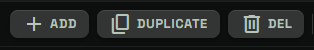
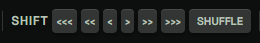
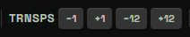
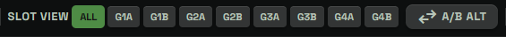
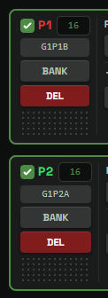
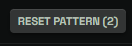

# Main Secondary Toolbar

## What The Secondary Toolbar Is For

The main secondary toolbar is the second control row above the pattern cards on the Control page.

It is focused on pattern-list management and batch edits:

- adding, copying, and deleting pattern cards
- shifting steps forward or backward
- transposing note names
- filtering the visible card list by slot area
- choosing A/B slot ordering
- saving patterns into the Bank
- resetting the focused pattern or checked patterns

Most controls in this row follow the current card selection. Checked cards matter. When no cards are checked, some controls use the focused pattern, while the batch edit controls apply to all patterns.

## Add

`ADD` appends a new blank pattern card to the end of the current list.

The new card becomes the focused pattern.

The main page supports up to 64 pattern cards. When the list is already full, `ADD` is disabled.

Use `ADD` when you want another empty slot in the current working canvas without loading from the TD-3 or importing a file.

## Duplicate

`DUPLICATE` copies existing pattern cards.

If no cards are checked, it duplicates the focused pattern.

If one or more cards are checked, it duplicates the checked cards and appends the copies to the bottom of the list in checked-order.

The 64-pattern limit still applies. If there is not enough room for every checked copy, only the copies that fit are added.

Use `DUPLICATE` when you want variations. A common workflow is to duplicate a pattern, then change its rests, slides, accents, U|D flags, transpose, or ending.

## Del

`DEL` removes pattern cards.

If no cards are checked, it deletes the focused pattern.

If one or more cards are checked, it deletes the checked patterns.

The editor keeps at least one pattern card. If deleting would remove the final card, that card is reset to a blank default instead.

Use `DEL` to clean up unwanted variations or reduce a large working set.

## Shift

The `SHIFT` group rotates step positions in the selected patterns.

The buttons are:

- `<<<`: shift back 4 steps
- `<<`: shift back 2 steps
- `<`: shift back 1 step
- `>`: shift forward 1 step
- `>>`: shift forward 2 steps
- `>>>`: shift forward 4 steps

Toolbar shift is a batch control:

- If one or more cards are checked, it shifts the checked cards.
- If no cards are checked, it shifts all pattern cards.

Shift does not change the notes, rests, slides, accents, or transpose flags themselves. It moves those step events to different positions in the loop.

Use shift when the pattern content is right but the groove starts in the wrong place.

The `SHUFFLE` button randomly shuffles the steps as-is in the selected patterns or all patterns if none checked.

## Trnsps

`TRNSPS` transposes stored note names.

The buttons are:

- `-1`: transpose down by one semitone
- `+1`: transpose up by one semitone
- `-12`: transpose down by one octave
- `+12`: transpose up by one octave

Toolbar transpose is a batch control:

- If one or more cards are checked, it transposes the checked cards.
- If no cards are checked, it transposes all pattern cards.

This changes the note names stored in the pattern. It does not toggle the TD-3 per-step `UP` or `DOWN` flags. Those step flags are handled by the step editor and the `U|D` randomizer.

Use `TRNSPS` when the pattern works but needs to sit in a different pitch range or key area.

## Slot View

`SLOT VIEW` filters which cards are visible in the pattern list.

The available chips are:

- `ALL`
- `G1A`
- `G1B`
- `G2A`
- `G2B`
- `G3A`
- `G3B`
- `G4A`
- `G4B`

`ALL` shows every pattern card.

A group-side chip shows only cards whose computed slot badge belongs to that area. For example, `G2B` shows cards assigned to Group 2, Side B.

Slot View is only a visibility filter. It does not delete patterns, change playback, write to the TD-3, or change pattern data.

Use it when a large 32 or 64 pattern canvas is easier to inspect one device area at a time.

## A/B Mode

The A/B mode button changes how pattern cards are assigned to TD-3 A and B side slots.

It toggles between:

- `A/B ALT`: A and B sides alternate by pattern number.
- `As->Bs SER`: all A-side slots come first, then all B-side slots.

This affects slot badges and target assignment for workflows that map the current canvas to device-like slots, including Push To TD-3 and Bank snapshot placement.

It does not change the musical content of any pattern.

Use A/B mode when you want the UI card order to match the way you think about the TD-3 memory layout.

## All To Bank

`ALL TO BANK` saves patterns from the current canvas into the Bank library.

If one or more cards are checked, it saves the checked cards.

If no cards are checked, it saves all pattern cards.

The destination modal lets you choose how the patterns should be saved. Depending on the available Bank data, you can save to a new snapshot, an existing snapshot, or standalone Bank items.

This is separate from writing to the TD-3. It saves patterns into the local library so they can be searched, compared, tagged, exported, and reused later.

Use `ALL TO BANK` when you want to keep generated or edited patterns beyond the current browser session.

## Reset Focused And Reset Pattern

The rightmost reset button changes label based on selection.

When no cards are checked, it reads `RESET FOCUSED`. Clicking it resets the focused pattern card to a blank default pattern.

When one or more cards are checked, it reads `RESET PATTERN (N)`, where `N` is the number of checked cards. Clicking it resets those checked cards.

This button is narrower than `RESET ALL PATTERNS` in the primary toolbar. It is intended for clearing one pattern or a selected group without wiping the whole canvas.

## Practical Workflow

A common secondary-toolbar workflow is:

1. Use `ADD` or `DUPLICATE` to create room for variations.
2. Check the cards you want to edit together.
3. Use `SHIFT` to move timing or `TRNSPS` to move pitch.
4. Use `SLOT VIEW` and A/B mode to inspect how the set maps to device slots.
5. Use `ALL TO BANK` to keep useful results.
6. Use `DEL` or `RESET FOCUSED` to clean up unwanted material.

The secondary toolbar is built for managing a working set, not for editing one step at a time. For single-card precision, use the controls on the pattern card itself.

