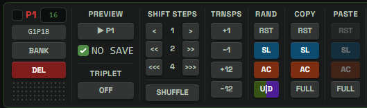
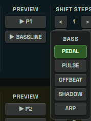
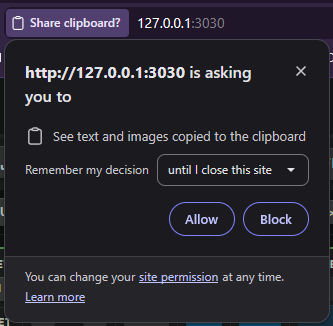
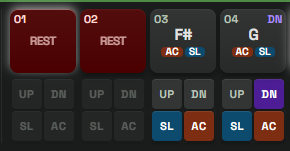

# Multipattern Row Buttons

## What A Pattern Row Is

Each pattern card in the main multipattern area has its own row of controls.

These controls are different from the main toolbar and sidebar:

- the sidebar can randomize the focused pattern or checked patterns
- the secondary toolbar can batch-edit checked patterns or all patterns
- the row buttons act on the pattern card they are attached to

Most row buttons also focus their pattern before acting. This keeps the focused card, keyboard editing, status messages, and undo history aligned with the thing you just touched.

## Selection Checkbox

The checkbox beside the pattern label includes that pattern in the checked selection.

Checked patterns are used by many bulk workflows:

- sidebar randomizer actions
- secondary toolbar duplicate and delete
- secondary toolbar shift and transpose
- timeline checked-mode playback
- save or Bank workflows that use checked patterns

Checking a pattern does not erase the focused pattern. Focus and checked selection are separate ideas:

- focus is the main single pattern you are editing
- checked selection is the group used for bulk actions

## Pattern Label

The `P1`, `P2`, `P3`, and later labels identify each pattern card by its current position in the canvas.

The label color helps separate rows visually when many patterns are on screen.

Pattern numbers can change when rows are deleted, duplicated, or reordered. They describe the current row order, not a permanent ID.

## Active Steps Field

The small number field beside the pattern label sets active steps for that one pattern.

It accepts values from `1` to `16`.

You can type a value or use the mouse wheel over the field to nudge the value up or down.

This is the per-pattern version of the global `STEPS` control. Use it when one pattern should have a shorter or longer loop length than the rest of the canvas.

## Slot Badge

The slot badge shows where this pattern maps in the current device-style slot layout.

Examples:

- `G1P1A`
- `G2P4B`
- `SNAPSHOT`

The badge is based on the current sidebar start slot, the A/B mode, and the configured scratch slot. The scratch slot is skipped when assigning device-write targets.

`SNAPSHOT` means this row does not currently map to a writable TD-3 slot in the computed layout. This can happen in overflow situations where the Bank snapshot path is needed to preserve the full set.

The slot badge is informational. Clicking it does not write anything.

## Bank

`BANK` saves this one pattern into the Bank library.

It opens the Bank destination flow for the row pattern only. From there, you can save it as a standalone item or place it into a snapshot depending on the available Bank options.

This does not write the pattern to the TD-3. It stores it in the local library.

## Del

`DEL` deletes this row's pattern.

If this is the only remaining pattern, the row is reset to a blank default pattern instead of leaving the canvas empty.

Use per-row `DEL` when you want to remove one specific pattern without using checked selection or the secondary toolbar delete action.

## Drag Handle

The small handle at the bottom of the row's ID column lets you reorder patterns by dragging.

Drag the handle onto another visible pattern row to move the source pattern to that position.

Focus and checked marks follow the moved pattern, so selection stays attached to the musical material rather than the old row number.

Reordering changes the visual pattern order and can affect timeline playback order and slot badge assignment.

## Preview

The `PREVIEW` button auditions this pattern on the TD-3.

There are two preview paths:

- normal preview writes this pattern to the configured scratch slot, starts TD-3 transport at the current BPM, and highlights the playing steps in this row
- `NO SAVE` preview plays the row from the host as timed MIDI Note On and Note Off messages without writing the scratch slot or starting the TD-3 sequencer

Clicking the active preview again stops it.

Only one row preview can run at a time. Starting preview on another row stops the previous row preview first.

Preview requires a MIDI connection. Normal preview also needs an available scratch slot. It will not start while the main transport is already playing.

## No Save

The row `NO SAVE` checkbox changes what `PREVIEW` does for that one pattern row.

When `NO SAVE` is checked, the row preview uses host-sequenced audition:

1. the app converts the current row pattern into timed note events
2. the app sends those notes directly to the TD-3 over MIDI
3. the TD-3 pattern memory and configured scratch slot are not written

When Live Update is off, row preview also uses the same non-saving audition path even if the row `NO SAVE` checkbox is not checked. This keeps Live Update off as a no-write editing mode.

During non-saving audition, changes to the row pattern are heard during playback without stopping and starting preview again. The update is applied at a safe note boundary so the currently sounding note is not cut short by the edit.

Use `NO SAVE` when you want to hear a row on the hardware without replacing the configured scratch pattern. Use normal preview when you want the TD-3 sequencer and scratch-slot playback behavior.

## Progression Page BASSLINE

The progression page has an additional row preview button that does not exist on the multipattern Control page:

- `▶ BASSLINE`: opens the supporting bassline archetype picker for that progression row.

Opening `▶ BASSLINE` does not immediately start playback. It reveals the per-row `BASS` menu with the available generated archetypes:

- `PEDAL`
- `PULSE`
- `OFFBEAT`
- `SHADOW`
- `ARP`

Clicking an archetype selects that supporting bassline for the row and auditions it on the TD-3. This lets you compare generated bassline roles for the same progression position without changing the acid pattern row itself.

The BASSLINE control depends on generated progression data. If no progression package has populated supporting basslines yet, the button cannot audition anything useful.

Only one preview path should be active at a time. Starting a bassline audition stops other row previews first, and preview state is tracked separately from the raw `▶ Pn` pattern preview.

## Triplet

The row `TRIPLET` button toggles triplet timing for this one pattern.

When it reads `ON`, the pattern uses triplet timing.

When it reads `OFF`, the pattern uses normal timing.

This changes how the pattern is interpreted during playback and export. It does not change note names, rests, slides, accents, or UP/DOWN flags.

Use the row Triplet button when only one pattern should change. Use the main toolbar Triplet control for batch triplet changes.

## Shift Steps

The row `SHIFT STEPS` controls rotate this one pattern's step positions.

The controls are arranged by shift size:

- shift by 1 step
- shift by 2 steps
- shift by 4 steps

The left buttons move steps backward. The right buttons move steps forward.

Shift keeps the contents of the steps but moves them earlier or later in the loop. Notes, rests, slides, accents, and UP/DOWN flags move together.

Use row shift when the pattern is good but starts in the wrong place.

## Shuffle

The row `SHUFFLE` button randomly shuffles this one pattern's step positions.

## Trnsps

The row `TRNSPS` buttons transpose this one pattern's stored note names.

The buttons are:

- `+1`: up one semitone
- `-1`: down one semitone
- `+12`: up one octave
- `-12`: down one octave

This changes the stored note names in the pattern.

It does not toggle the TD-3 per-step `UP` or `DOWN` flags. Those flags are edited by the step controls and the `U|D` randomizer.

Use row transpose when one pattern needs to move into a different pitch area without changing the rest of the canvas.

## Rand

The row `RAND` buttons randomize one part of this pattern.

They use the sidebar slider values and the current slicer range, if the slicer is on. Unlike the sidebar randomizer buttons, row randomizer buttons target only this row.

The row randomizer buttons are:

- `RST`: reshuffles which steps are rests and which are active notes, using the note percentage.
- `SL`: reshuffles slide placement on active steps, using the slide percentage.
- `AC`: reshuffles accent placement on active steps, using the accent percentage.
- `U|D`: reshuffles UP and DOWN transpose flags, using the U|D percentage.

These buttons are useful when a row is close but one musical layer needs a new version.

## Copy

The row `COPY` buttons copy parts of this pattern.

The available copy buttons are:

- `RST`: copy the rest mask
- `SL`: copy slide placement
- `AC`: copy accent placement
- `FULL`: copy the full pattern

`RST`, `SL`, and `AC` copy only one layer, so it can be pasted onto another pattern without replacing the whole pattern.

`FULL` copies the complete pattern into the app clipboard. It also tries to write a `.steps.txt` version to the system clipboard so the pattern can be pasted into a text app when the browser allows it.

## Paste

The row `PASTE` buttons paste copied material into this pattern.

The available paste buttons are:

- `RST`: paste a copied rest mask
- `SL`: paste copied slide placement
- `AC`: paste copied accent placement
- `FULL`: paste a full copied pattern

`RST`, `SL`, and `AC` are enabled only when that clipboard layer has content.

`FULL` first tries to read a valid `.steps.txt` pattern from the system clipboard. If that is not available, it falls back to the app's in-memory full-pattern clipboard.

Use paste to transfer groove, slide, accent, or full-pattern structure between rows.

## Step Cards

The 16 step cards on the right are also part of the row.

Click behavior depends on keyboard edit mode:

- with `KB EDIT` off, clicking a step cycles its time state
- with `KB EDIT` on, clicking a step selects it for keyboard editing

Mouse wheel over a sounding note changes its note value up or down. The wheel does not change notes on rest or tie steps.

Each step has small control buttons:

- `UP`: toggle the step's UP transpose flag
- `DN`: toggle the step's DOWN transpose flag
- `SL`: toggle slide
- `AC`: toggle accent

The step card display also shows:

- the step number
- the note name, `REST`, `TIE`, or `T-R`
- visible `UP` or `DN` markers when active
- slide and accent indicators when present

Steps beyond the pattern's active step count are visually dimmed.

## Practical Workflow

A common row-level workflow is:

1. Duplicate or add patterns until you have several ideas.
2. Use row `PREVIEW` to audition one pattern at a time.
3. Use row `RAND` buttons to vary rests, slides, accents, or U|D flags.
4. Use `COPY` and `PASTE` to transfer useful rhythm or expression layers.
5. Use row `SHIFT STEPS` or `TRNSPS` for one-pattern timing and pitch changes.
6. Use `BANK` to keep strong results.
7. Use `DEL` to remove weak versions.

Row controls are best for precise work on one pattern at a time. Use the sidebar and secondary toolbar when you want to apply changes across a checked group or the whole canvas.
