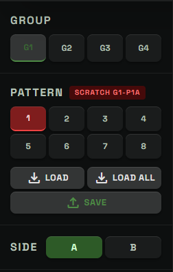
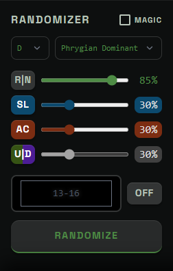
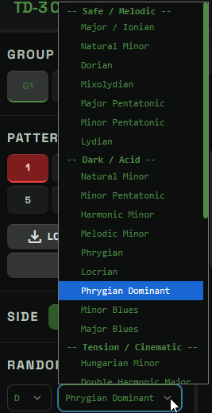
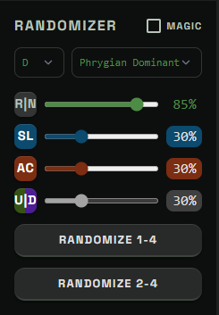

# Main Page Sidebar

## What The Sidebar Is For

The main page sidebar is the control area for device slot selection and pattern generation.

It does two main jobs:

- It chooses where patterns come from or go on the TD-3.
- It shapes new pattern material with the randomizer.

The center of the page is where patterns are edited. The sidebar is where you choose the hardware address, set musical generation options, and decide how randomization should behave.

## Group

The `GROUP` buttons choose the TD-3 group.

The TD-3 has four groups:

- `G1`
- `G2`
- `G3`
- `G4`

Together with the pattern number and side, the group forms a full TD-3 slot address such as `G1P1A` or `G3P8B`.

Use this section when you want to load from a specific hardware slot, save to a specific hardware slot, or prepare a push workflow that starts from a particular place.

## Pattern

The `PATTERN` buttons choose the pattern number inside the selected group and side.

There are eight pattern numbers:

- `1` through `8`

The selected pattern number is part of the device slot address. For example, if the group is `G2`, the pattern is `5`, and the side is `B`, the selected address is `G2P5B`.

## Scratch Slot Label

The red scratch label shows the configured scratch slot.

The scratch slot is the TD-3 slot used for live update, preview, and other temporary playback workflows. It is expected to be overwritten during active editing.

When a pattern button is marked in red, that slot is the scratch slot for the currently selected group and side.

This label is a safety reminder. If you are using Live Update or preview workflows, do not store important material only in the scratch slot.

## Load

`LOAD` reads the selected TD-3 slot and adds it to the pattern list in the main editor.

It does not replace the current pattern. It appends the loaded pattern as a new card, then focuses that new card.

Use `LOAD` when:

- you want to bring one hardware pattern into the editor
- you want to compare a device slot against existing UI patterns
- you want to build a multipattern set from selected TD-3 slots

`LOAD` requires a MIDI connection. It is disabled when the app is not connected to the TD-3.

## Load All

`LOAD ALL` reads all 64 TD-3 slots into the main editor.

This is a larger operation. It replaces the current pattern list in the UI with the full device bank after confirmation.

Before loading, the app asks how the A and B sides should be ordered:

- A/B alternate: `G1P1A`, `G1P1B`, `G1P2A`, `G1P2B`, and so on.
- Serial: all A-side slots first, then all B-side slots.

Use `LOAD ALL` when:

- you want to inspect the whole TD-3 memory
- you want to archive or reorganize a full device bank
- you want the UI pattern list to match the device contents

If the current UI list contains unsaved edits, treat `LOAD ALL` carefully because it replaces the current list.

## Save

`SAVE` writes UI pattern material back to the TD-3.

Its behavior depends on the current selection:

- If one pattern is focused or selected, `SAVE` writes that pattern to the sidebar-selected TD-3 slot.
- If multiple patterns are checked, `SAVE` opens a confirmation flow for writing the checked patterns to their assigned TD-3 slots.
- If nothing is available to save, the button is disabled.

For a single pattern, the sidebar address is the destination. Check the `GROUP`, `PATTERN`, and `SIDE` sections before clicking `SAVE`.

For multiple checked patterns, the app uses the current slot layout rules rather than writing every pattern to the same address.

`SAVE` requires a MIDI connection.

## Side

The `SIDE` buttons choose between side `A` and side `B`.

Side is the last part of a TD-3 slot address. For example:

- `G1P1A` is group 1, pattern 1, side A.
- `G1P1B` is group 1, pattern 1, side B.

Switching side changes which hardware slot is selected for load and save operations.

## Randomizer Section

The `RANDOMIZER` section creates new musical material for the focused pattern or checked patterns.

If one or more pattern cards are checked, sidebar randomizer actions apply to the checked set.

If no cards are checked, sidebar randomizer actions apply to the focused pattern.

This lets the same controls work for both single-pattern editing and bulk generation.

## MAGIC

The `MAGIC` checkbox switches the main randomizer into a more phrase-aware mode.

When `MAGIC` is off, the regular randomizer creates scale-based material quickly and directly.

When `MAGIC` is on, randomization pays more attention to musical shape, tonal center, scale identity, movement balance, and loop feel.

Use regular randomization when you want faster surprise and rougher accidents.

Use `MAGIC` when you want generated material that is more likely to feel like a complete musical phrase.

The setting is remembered by the browser, so it can stay on or off across page reloads.

Full explanation of the `MAGIC` vs. regular randomization algo is here: [SIMPLE VS. MAGIC RANDOMIZER](docs/SIMPLE_VS_MAGIC_RANDOMIZER.md)

## Detected Key Chip

Sometimes the sidebar shows a detected key chip under the randomizer heading.

This appears when imported or loaded material gives the app enough musical information to suggest a root and scale. It is advisory. You can keep the suggestion, change the root or scale manually, or dismiss the chip.

The chip helps you continue generation in a key that matches existing material.

## Root And Scale

The root selector chooses the tonal center for generated patterns.

The scale selector chooses the note collection used by the randomizer.

Together, root and scale answer the question: "What musical world should this pattern come from?"

Examples:

- `C` plus minor creates material centered around C minor.
- `F#` plus phrygian creates material centered around F# phrygian.
- `A` plus a pentatonic scale creates a simpler, more open note set.

These controls affect generated notes. They do not automatically transpose existing hand-edited material unless you run a randomizer action.

## R Or N Control

The `R|N` button and the top slider control note density and rest placement.

The percentage sets how many steps should become active notes rather than rests. A higher percentage creates denser patterns. A lower percentage creates more space.

Clicking `R|N` reshuffles only the rest and note pattern using the current percentage.

This is useful when the pitches are good but the rhythm feels too busy, too empty, or too predictable.

## Slide Control

The `SL` button and slider control slide density.

Slides are a core part of acid phrasing. They connect notes and create the gliding movement associated with the TD-3 sound.

The percentage sets how often active steps should receive slides.

Clicking `SL` reshuffles only the slide placement while keeping the rest of the pattern structure intact.

## Accent Control

The `AC` button and slider control accent density.

Accents make selected steps hit harder and can strongly change the groove.

The percentage sets how often active steps should receive accents.

Clicking `AC` reshuffles only the accent placement while preserving the rest of the pattern.

## U Or D Control

The `U|D` button and slider control UP and DOWN transpose flags.

These flags are the TD-3 step-level transpose choices. An `UP` flag pushes a step upward, a `DOWN` flag pushes a step downward, and `NORMAL` leaves the step unshifted.

The percentage sets how many steps in the affected range should receive either an `UP` or `DOWN` flag.

Clicking `U|D` reshuffles only those transpose flags:

- chosen steps receive either `UP` or `DOWN`
- unchosen steps are cleared back to `NORMAL`
- the note names, rests, slides, and accents are preserved

The split between `UP` and `DOWN` is randomized, so the control can create sharper acid movement without changing the base note pattern.

Unlike slide and accent randomization, `U|D` can write flags on rested steps too. If a rested step is later turned back into a note, its stored UP or DOWN flag can become audible.

## Slicer

The slicer limits randomization to a specific step range.

Enter a range such as:

- `13-16` for steps 13 through 16
- `1-4` for the first four steps
- `5,9-12` for a single step plus a range

Turn the slicer `ON` to make randomizer actions affect only the selected steps.

Turn it `OFF` to let randomizer actions affect the full pattern.

The slicer is useful when most of a pattern works, but one section needs a new ending, fill, variation, or rhythmic change.

## Randomize

The large `RANDOMIZE` button creates a new pattern using the current sidebar settings.

It uses:

- the selected root
- the selected scale
- the note density
- the slide density
- the accent density
- the slicer setting, if enabled
- the `MAGIC` setting, if enabled

If no pattern cards are checked, it randomizes the focused pattern.

If pattern cards are checked, it randomizes all checked patterns.

Use this button when you want a new full idea, a new sliced variation, or a batch of related generated patterns.

## Progression Page Randomize

On the progression page, the sidebar randomize controls operate on the four-pattern progression instead of the multipattern Control page selection model.

The primary randomize action is the progression page's `RANDOMIZE 1-4` behavior:

- creates fresh P1, P2, P3, and P4 progression patterns
- uses the selected root, scale, note density, slide density, accent density, and `MAGIC` setting
- derives the progression roles together so the four rows form a related set
- regenerates the supporting bassline package for the new progression
- resets the timeline to the start, or queues the reset for the next wrap if playback is already running
- sends the new P1 to the scratch slot only when Live Update is on and the TD-3 is connected

The progression page also exposes `RANDOMIZE 2-4`, which does not exist on the multipattern Control page.

`RANDOMIZE 2-4` keeps the current P1 exactly as it is and regenerates only P2, P3, and P4 around that locked first pattern. Use it when P1 is already a good anchor and you want new movement, tension, and resolution rows without losing the starting idea.

`RANDOMIZE 2-4` still uses the current root, scale, density sliders, and `MAGIC` setting for the regenerated rows. It also rebuilds the supporting bassline package and updates progression metadata, but it skips re-sending P1 to the device because P1 did not change.

If no P1 exists yet, use `RANDOMIZE 1-4` or send a pattern to the progression page first. `RANDOMIZE 2-4` needs an existing P1 to derive the remaining rows.

## Practical Workflow

A common sidebar workflow is:

1. Pick a hardware address with `GROUP`, `PATTERN`, and `SIDE`.
2. Use `LOAD` if you want to bring that TD-3 slot into the editor.
3. Choose root and scale for generation.
4. Set note, slide, accent, and U|D amounts.
5. Turn `MAGIC` on if you want a more phrase-shaped result.
6. Use the slicer when only part of the pattern should change.
7. Click `RANDOMIZE`, or use `R|N`, `SL`, `AC`, and `U|D` for narrower changes.
8. Use `SAVE` only after confirming the destination slot.

The sidebar is powerful because it sits between two worlds: the TD-3 hardware memory and the musical generator. Check the slot address before writing, and use the randomizer controls to shape the kind of material you want before committing it.
