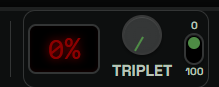
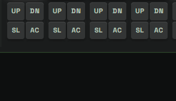
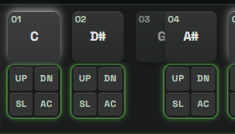
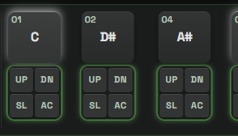
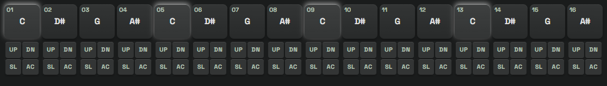
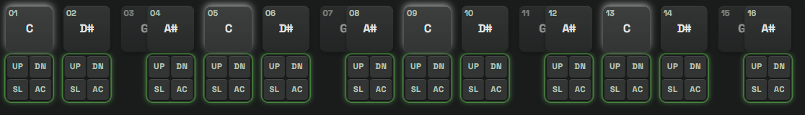
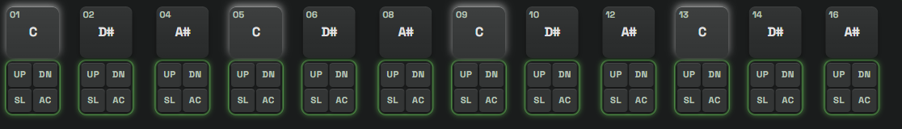
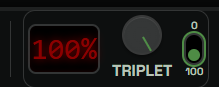

# Triplet Morph

## What It Is

`TRIPLET` continuously warps a straight pattern toward a triplet feel
while the host plays it, without changing tempo, without changing bar
length, and without writing anything to the TD-3.

At `0%` you hear the ordinary 16-step pattern. Turn the knob up and the
offbeats slide toward triplet positions. At `100%` each beat holds three
evenly spaced notes instead of four.

Return the knob to `0%` and the original pattern is exactly as it was.
Nothing was converted. The knob never edits your pattern; it only
changes how the pattern is played back.

The control appears on the Control page and the Progression page, in the
bottom toolbar next to `GATE`. It is visible only while `LIVE` is off,
because the transform belongs to non-saving host audition.

Because it plays through host audition, it is heard only on the MIDI
channel the TD-3 is set to. If the morph is silent while `LIVE` playback
works, check the `CH` selector in the
[Bottom Toolbar](BOTTOM_TOOLBAR.md#ch-device-midi-channel).

## The Control

| Part | Behavior |
| --- | --- |
| Display | Shows the current amount as a whole percentage |
| Knob | Mouse wheel or arrow keys change by 1, drag vertically for larger moves, `PageUp` and `PageDown` change by 10, `Home` sets `0`, `End` sets `100` |
| Toggle | Flips straight to the opposite endpoint: up is `0`, down is `100` |

The toggle is a shortcut, not a second value. Clicking it from any knob
position jumps to the opposite end. It mirrors the knob only at the
exact endpoints, so sweeping the knob through the middle leaves the
toggle where it was.

## What Stays Fixed

Three things never change as you turn the knob:

- **Tempo.** BPM is untouched. A beat lasts exactly as long at `100%` as
  it does at `0%`.
- **Bar length.** The loop is the same duration at every amount, so the
  pattern stays in time with everything else.
- **Beat starts.** The first note of every beat stays exactly on the
  beat. Only the notes between beats move.

## How A Beat Transforms

A straight beat has four cells. A triplet beat has three. One note per
beat has to go.

Beat one of a pattern, at three knob positions:

| `0%` straight | `50%` mid-transform | `100%` triplet |
| --- | --- | --- |
|  |  |  |

At `0%` the four notes sit on the straight grid.

At `50%` they have moved halfway to their triplet destinations. All four
still sound. The note that will be removed is dimmed and is sliding into
the note it will merge with; it keeps sounding until it gets close
enough to merge, as described below.

At `100%` three notes remain, evenly spaced across the beat. The fourth
has merged away.

The whole pattern behaves the same way:

**`0%`**

**`50%`**

**`100%`**

## Which Note Gets Removed

The app does not simply drop every fourth note. It reads what the beat
is actually doing and removes the note whose loss costs the least
musically.

For a beat with cells `1 2 3 4`, it compares the three ways to keep two
offbeats, and scores each by what it would destroy, in this order:

1. **Slides.** A slide is a relationship between two notes. Breaking it
   changes the phrase in a way no other note can repair, so slide
   connectivity is protected first.
2. **Accents.** An accented note is a deliberate emphasis. It survives
   before a plain offbeat.
3. **Rests that cut a note.** A rest that actually stops a sounding note
   is shaping the phrase. Silence after silence costs nothing.
4. **Melodic shape.** A note that is a high point, a low point, or the
   only pitch change between two identical neighbors is worth keeping.
5. **Number of notes.** All else equal, keep more notes.
6. **Tie length.** A tie that belongs to a surviving note is worth
   keeping.
7. **Distance moved.** When nothing above separates the options, choose
   the pair that has to travel least.

The first rule that distinguishes two options decides it. There is no
scoring soup and no tuning knobs.

When every note in the beat is equal, this lands on keeping cells `2`
and `4` and removing cell `3`, because that pair moves the shortest
distance to reach the triplet positions. That is why the default
pattern above drops steps `03`, `07`, `11`, and `15`.

### When The Removed Note Stops Sounding

The removed note does not play all the way to `100%`.

As the knob rises, the removed note slides closer and closer to the note
it merges with. Once the two are within `20 ms` of each other, the TD-3
can no longer sound them as two notes: it is monophonic, so a second
retrigger that close produces a flam or a click rather than a note. The
removed note's own length has also shrunk below what its amplifier
envelope needs.

At that point the app retires the removed note early. It simply stops
playing, while everything else keeps warping normally.

The result is that the change from four notes per beat to three happens
where the two notes had already blurred into one, so you hear a smooth
transition instead of a click at the top of the sweep.

The `20 ms` floor is a fixed time, so the amount at which it happens
depends on tempo:

| Tempo | Removed note retires above |
| --- | --- |
| 20 BPM | `97%` |
| 120 BPM | `84%` |
| 136 BPM | `82%` |
| 300 BPM | `60%` |

A note that is part of a slide is never retired this way. A slide glides
into its target instead of retriggering it, so there is no second attack
to collide, and cutting one would break the glide.

Two more rules keep the result honest:

- A note never inherits another note's accent, pitch, or slide. The
  removed note's properties are not donated to a survivor.
- The decision is made once, for the whole pattern, when you first turn
  the knob up. It does not change as you sweep, so notes never swap
  identity mid-gesture.

## Editing While Morphed

Editing is available at `0%` and at `100%`, and locked in between.

- At `0%` everything works normally.
- Between `1%` and `99%` the notes are mid-flight and no cell has a
  settled position, so the grid does not accept edits.
- At `100%` you can edit the notes that are still there.

The `UP` `DN` `SL` `AC` block under each note does not move with its
note card. It stays in place and stays bound to the note it belongs to.
While the knob is above `0%`, the blocks belonging to surviving notes
pulse green:

That green outline is the answer to "which notes can I edit in triplet
mode". In the `100%` screenshot further up, the outlined blocks line up
exactly with the twelve remaining cards, and the four unmarked blocks
are the removed steps.

Randomizing at `100%` follows the same rule: `RST`, `SL`, `AC`, and
`U|D` only rewrite the notes that are visible in triplet mode. The
removed notes are left untouched.

Bulk operations that move or replace a whole pattern stay unavailable
above `0%`: shift, transpose, shuffle, reset, add, delete, import,
undo, redo, paste, active-step changes, and the native triplet toggle.
They would rewrite the removed notes as well and scramble the mapping.
Return the knob to `0%` to use them.

## Pattern Lengths

`TRIPLET` works with patterns of `4`, `8`, `12`, or `16` active steps,
which is one, two, three, or four beats. Each beat becomes three
triplet cells, so a `4`-step pattern turns into `3` cells and a
`12`-step pattern turns into `9`.

The knob is unavailable when any pattern that could be played is:

- not one of those four lengths, or
- already using the TD-3's own native triplet mode.

The status line explains the refusal. The app never silently changes a
pattern's length or triplet flag to make the morph fit.

## What The Device Receives

Nothing is written to the TD-3. The morph exists only in host audition:
the app sends timed note messages and the TD-3 sounds them, exactly as
it does for ordinary non-saving playback.

Turning `LIVE` on while a morph is active stops the audition, silences
any sounding notes, restores the straight view, and resets the knob to
`0%` before normal live behavior resumes. No derived pattern is ever
saved to a slot.

## Practical Use

1. Turn `LIVE` off.
2. Press `PLAY`.
3. Sweep `TRIPLET` and listen to the feel change while the tempo holds.
4. Use the toggle to snap between straight and full triplet on a
   downbeat.
5. At `100%`, edit or randomize the surviving notes to write a phrase
   that only exists in triplet form.
6. Return to `0%` at any time to get the original pattern back.

## Related

- [Bottom Toolbar](BOTTOM_TOOLBAR.md) - the rest of the transport strip
- [Progressions](PROGRESSIONS.md) - the Progression page
